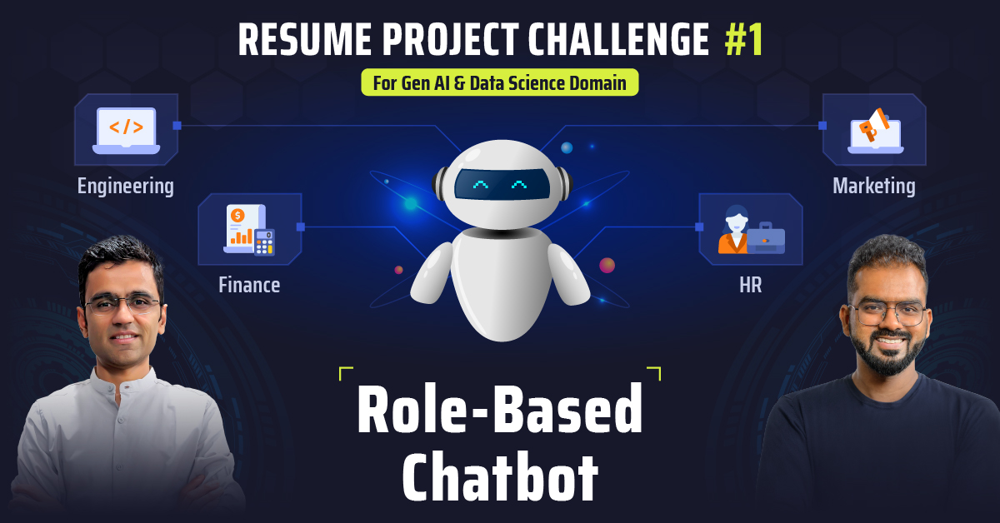

# DS RPC 01: Internal chatbot with role based access control

This is the starter repository for Codebasics's [Resume Project Challenge](https://codebasics.io/challenge/codebasics-gen-ai-data-science-resume-project-challenge) of building a RAG based Internal Chatbot with role based access control. Please fork this repository to get started.

Basic Authentication using FastAPI's `HTTPBasic` has been implemented in `main.py` for learners to get started with.

Visit the challenge page to learn more: [DS RPC-01](https://codebasics.io/challenge/codebasics-gen-ai-data-science-resume-project-challenge)

### Roles Provided
 - **engineering**
 - **finance**
 - **general**
 - **hr**
 - **marketing**


## Environment Setup and download requirements
```
uv venv   ( python version: 3.10.17 )
uv add -r requirements.txt
```

## Run command to make the vector database
```
python app\Storage\vectors.py         ( create vector database for vector retrieval )
python app\Storage\keyword_ret.py     ( create vector database for keyword retrieval )
```


## Run backend and frontend
```
python main.py              ( run backend )
streamlit run frontend.py   ( run frontend )
```

# Images
### Backend image
